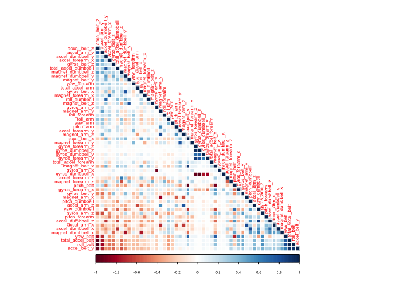
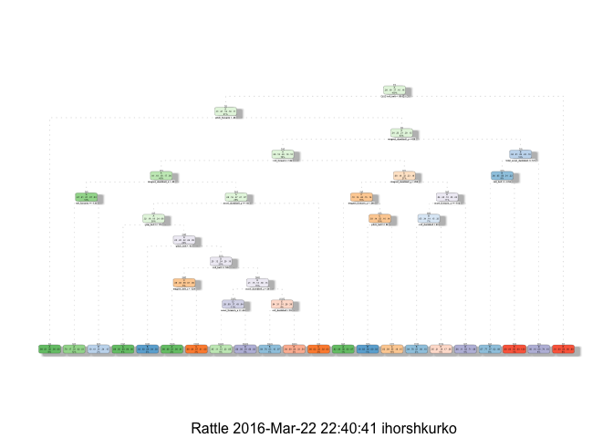

# The manner prediction in which people did the exercise
by Ihor Shkurko

# Synopsis

The goal of this project is to predict the manner in which people did the exercise. We will use different variables to predict with. We will create a report describing how we built  model, how we used cross validation, what we think the expected out of sample error is, and why we made the choices we did. We will also use your prediction model to predict 20 different test cases.

Using devices such as Jawbone Up, Nike FuelBand, and Fitbit it is now possible to collect a large amount of data about personal activity relatively inexpensively. These type of devices are part of the quantified self movement – a group of enthusiasts who take measurements about themselves regularly to improve their health, to find patterns in their behavior, or because they are tech geeks. One thing that people regularly do is quantify how much of a particular activity they do, but they rarely quantify how well they do it. In this project, our goal will be to use data from accelerometers on the belt, forearm, arm, and dumbell of 6 participants. People were asked to perform barbell lifts correctly and incorrectly in 5 different ways.

# Data Processing

The training data for this project are available here:
<a href="https://d396qusza40orc.cloudfront.net/predmachlearn/pml-training.csv">Training data</a>

The test data are available here:
<a href="https://d396qusza40orc.cloudfront.net/predmachlearn/pml-testing.csv">Test data</a>

Setup seed to make report reproducible

```r
set.seed(777)
```

Data loading

```r
if (!file.exists("pml-training.csv")) download.file("https://d396qusza40orc.cloudfront.net/predmachlearn/pml-training.csv",
              destfile = "pml-training.csv", method = "curl")

if (!file.exists("pml-testing.csv")) download.file("https://d396qusza40orc.cloudfront.net/predmachlearn/pml-testing.csv",
              destfile = "pml-testing.csv", method = "curl")


trainingd <- read.csv("pml-training.csv", header = TRUE, na.strings = c("NA", "#DIV/0!"))
testingd  <- read.csv("pml-testing.csv", header = TRUE, na.strings = c("NA", "#DIV/0!"))
dim(trainingd)
```

```
## [1] 19622   160
```

Remove variables that have missing data

```r
trainingd <- trainingd[, colSums(is.na(trainingd)) == 0]
dim(trainingd)
```

```
## [1] 19622    60
```

Leave only data from sensors

```r
trainingd <- trainingd[, -c(1:7)]
dim(trainingd)
```

```
## [1] 19622    53
```

Data partition for training and testing

```r
require(caret)
partitions <- createDataPartition(trainingd$classe, p = 0.6, list = FALSE)
trainingsubd <- trainingd[partitions, ]
testingsubd <- trainingd[-partitions, ]
dim(trainingsubd)
```

```
## [1] 11776    53
```

```r
dim(testingsubd)
```

```
## [1] 7846   53
```

After data prosessing we will use 52 variables for machine learning and prediction.

Variable **classe**:
Class A corresponds to the specified execution of the exercise, while the other 4 classes correspond to common mistakes.

Read more: <a href="http://groupware.les.inf.puc-rio.br/har">http://groupware.les.inf.puc-rio.br/har</a>

# Prediction models

## Prediction through Decision Trees

Training on training data subset

```r
require(rpart)
modfitdt <- rpart(classe ~ ., data = trainingsubd)
```

Prediction on testing data subset

```r
predictdt <- predict(modfitdt, newdata = testingsubd, type = "class")
confusionMatrix(predictdt, testingsubd$classe)
```

```
## Confusion Matrix and Statistics
## 
##           Reference
## Prediction    A    B    C    D    E
##          A 2011  234   94  153   48
##          B   83  941   83  115  119
##          C   57  126 1021  191  170
##          D   47  113   72  686   57
##          E   34  104   98  141 1048
## 
## Overall Statistics
##                                           
##                Accuracy : 0.7274          
##                  95% CI : (0.7174, 0.7372)
##     No Information Rate : 0.2845          
##     P-Value [Acc > NIR] : < 2.2e-16       
##                                           
##                   Kappa : 0.6533          
##  Mcnemar's Test P-Value : < 2.2e-16       
## 
## Statistics by Class:
## 
##                      Class: A Class: B Class: C Class: D Class: E
## Sensitivity            0.9010   0.6199   0.7463  0.53344   0.7268
## Specificity            0.9058   0.9368   0.9160  0.95595   0.9411
## Pos Pred Value         0.7917   0.7017   0.6524  0.70359   0.7354
## Neg Pred Value         0.9583   0.9113   0.9448  0.91268   0.9386
## Prevalence             0.2845   0.1935   0.1744  0.16391   0.1838
## Detection Rate         0.2563   0.1199   0.1301  0.08743   0.1336
## Detection Prevalence   0.3237   0.1709   0.1995  0.12427   0.1816
## Balanced Accuracy      0.9034   0.7783   0.8312  0.74469   0.8339
```

## Prediction through Random Forest

Training on training data subset
We will use 10 cross-validation when building model.

```r
require(randomForest)
tc <- trainControl(method = "cv", 10)
modfitrf <- randomForest(classe ~ ., data = trainingsubd, trControl = tc)
```

Prediction on testing data subset

```r
predictrf <- predict(modfitrf, newdata = testingsubd)
confusionMatrix(predictrf, testingsubd$classe)
```

```
## Confusion Matrix and Statistics
## 
##           Reference
## Prediction    A    B    C    D    E
##          A 2228    6    0    0    0
##          B    1 1512   20    0    0
##          C    3    0 1346   20    4
##          D    0    0    2 1266    6
##          E    0    0    0    0 1432
## 
## Overall Statistics
##                                           
##                Accuracy : 0.9921          
##                  95% CI : (0.9899, 0.9939)
##     No Information Rate : 0.2845          
##     P-Value [Acc > NIR] : < 2.2e-16       
##                                           
##                   Kappa : 0.99            
##  Mcnemar's Test P-Value : NA              
## 
## Statistics by Class:
## 
##                      Class: A Class: B Class: C Class: D Class: E
## Sensitivity            0.9982   0.9960   0.9839   0.9844   0.9931
## Specificity            0.9989   0.9967   0.9958   0.9988   1.0000
## Pos Pred Value         0.9973   0.9863   0.9803   0.9937   1.0000
## Neg Pred Value         0.9993   0.9990   0.9966   0.9970   0.9984
## Prevalence             0.2845   0.1935   0.1744   0.1639   0.1838
## Detection Rate         0.2840   0.1927   0.1716   0.1614   0.1825
## Detection Prevalence   0.2847   0.1954   0.1750   0.1624   0.1825
## Balanced Accuracy      0.9986   0.9964   0.9899   0.9916   0.9965
```

## Model selection

The accuracy of regression modeling methods:

1. Decision Tree: **0.7274**. Out of sample error in this predisction is 27% - very high.
2. Random Forest: **0.9921**. Out of sample error in this predisction is 0.8% - good result.

# Testing

As Random Forest has highest accuracy, we will use it to predict the testing dataset.

```r
predict(modfitrf, newdata = testingd)
```

```
##  1  2  3  4  5  6  7  8  9 10 11 12 13 14 15 16 17 18 19 20 
##  B  A  B  A  A  E  D  B  A  A  B  C  B  A  E  E  A  B  B  B 
## Levels: A B C D E
```

# Annex 1: Correlation Matrix

Correlation matrix for variables we had analyse before modeling.
Plot with the first principal component order (FPC).

```r
require(corrplot)
cm <- cor(trainingsubd[, c(1:52)])
par(cex = 0.5)
corrplot(cm, order = "FPC", method = "color", type = "lower")
```

 

# Annex 2: Decision Tree

Decision tree view with fancy

```r
library(rattle)
par(cex = 1)
fancyRpartPlot(modfitdt)
```

 

